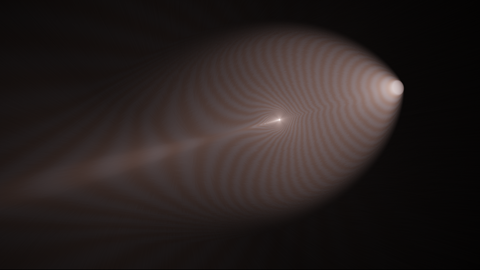
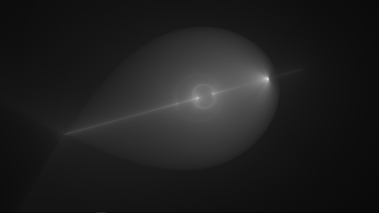
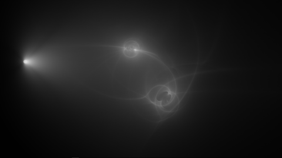
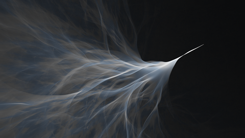
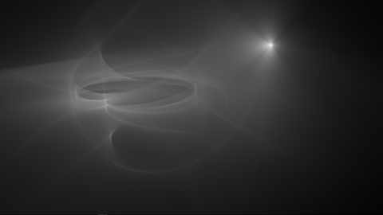

# Gravy: A webGL simulation of gravitational lensing in three dimensions

A webGL visualization of gravitationally lensed light paths in three dimensions. Click below for live demos, and author your own via the API.

<a href="https://cdn.rawgit.com/portsmouth/gravy/v1.0.2/exampleScenes/pointmass.html"></a><a href="https://cdn.rawgit.com/portsmouth/gravy/v1.0.2/exampleScenes/1mass.html"></a>
<a href="https://cdn.rawgit.com/portsmouth/gravy/v1.0.2/exampleScenes/2mass.html"></a><a href="https://cdn.rawgit.com/portsmouth/gravy/v1.0.2/exampleScenes/4mass.html"></a>
<a href="https://cdn.rawgit.com/portsmouth/gravy/v1.0.2/exampleScenes/noise.html"></a><a href="https://cdn.rawgit.com/portsmouth/gravy/v1.0.2/exampleScenes/disk.html"></a>

UI controls:
 - left-click mouse to rotate, right-click mouse to pan
 - F to frame camera on initial position and orientation
 - P to capture a screenshot of the current render in a new browser window
 - R to reset to initial state
 - O to serialize scene code to the JavaScript console
 - H to hide/show the sidebar UI
 - F11 to enter/exit fullscreen mode


In the presence of a sufficiently strong gravitational field (produced by large amounts of matter, e.g. stars, galaxies, and dark matter), space is curved and causes light rays to be deflected towards matter. This produces a focusing effect which is known as [gravitational lensing](https://en.wikipedia.org/wiki/Gravitational_lens), where luminous objects behind a distribution of mass appear to be distorted. 

Gravy simulates this effect, in order to show the paths which the light follows. A large number of simulated rays are emitted from a light source, and the curved path of each drawn. When enough paths have been drawn, the resulting image converges to a visualization of the amount of light energy everywhere in space in the steady state. There is a single light source, a disk with a variable beam angle, directed along the negative x-axis. The mass distribution is specified in the form of the 3d gravitational potential, via GLSL code. 

The simulation makes the assumption that the gravitational field is not so strong that the full effects of general relativity need to be taken into account. In this approximation, the effect is exactly analogous to refraction, with the refractive index of space driven by the local gravitational potential. The approximation breaks down sufficiently close to large masses however.

 In fact in classic lensing systems in astronomy ([galactic lensing](https://en.wikipedia.org/wiki/Einstein_ring) or [microlensing](https://en.wikipedia.org/wiki/Gravitational_microlensing)) the angular deflection is actually very small, on the order of arcminutes at most. (Also, there are cosmological effects involved because the distances are so large).
 In the examples shown here, the lensing is much stronger, producing large angular deflections, even causing the light to bend into loops. This would only happen in reality if the light source is positioned close to a massive compact object like a [black hole](https://en.wikipedia.org/wiki/Black_hole) or neutron star. Strictly speaking a full general relativistic simulation is needed in this scenario, but the simulation can at least be considered a first order approximation. Note also that technically, there should be factors of the gravitational constant and the speed of light involved (e.g. the potential has units of speed of light squared). These constants have been effectively set to 1, so the lengths are in units related to the [Schwarzschild radius](https://en.wikipedia.org/wiki/Schwarzschild_radius) of the system. As Gravy is not intended to be a fully scientifically accurate simulation, this seems a reasonable approach.

There is an experimental system for visualizing with color bands the "time delay" along each light path. In this effect, the total time each light ray takes to travel from source to observer is different, both due to the curving of the path, and also due to time dilation (the so-called [Shapiro delay](https://en.wikipedia.org/wiki/Shapiro_delay)).


# API Reference

Note that authoring a demo requires nothing more than the external javascript link
```html
<script src="https://rawgit.com/portsmouth/gravy/v1.0.2/js/compiled/gravy.min.js"></script>
```
So demos can be hosted anywhere, e.g. in your own GitHub repo and served via RawGit.

<dl>
<dt><a href="docs/API.md/#Gravy">Gravy</a></dt>
<dd></dd>
<dt><a href="docs/API.md/#Potential">Potential</a></dt>
<dd></dd>
<dt><a href="docs/API.md/#Renderer">Renderer</a></dt>
<dd></dd>
</dl>
